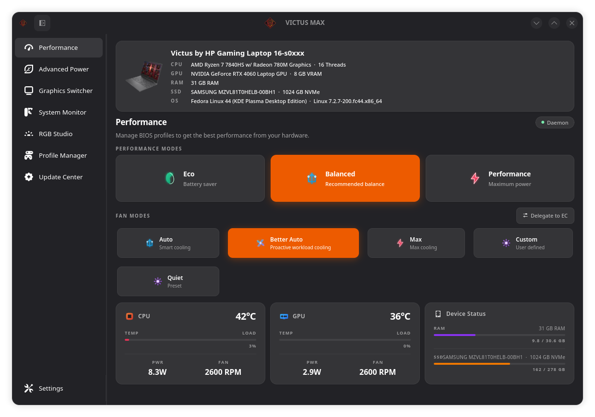

<div align="center">
  

  # Victus Max

  **The definitive Linux control center and proactive cooling system for HP Victus & OMEN laptops.**  
  *Powered by proactive "Better Auto" workload sensing and written entirely in native Rust & GTK4.*

  [](https://github.com/umutaktepe/victus-max)
  [](LICENSE)
  []()
  []()
</div>

---

## 📖 Overview

**Victus Max** is a dedicated, high-performance Linux system utility built specifically for HP Victus and OMEN gaming laptops. 

While OEM BIOS fan control is notoriously sluggish and reactive—only spinning up after temperatures have already spiked into thermal throttling territory—Victus Max brings the intelligence of **Better Auto**: an algorithm that monitors real-time CPU/GPU workloads (`/proc/stat` delta) to preemptively spin up cooling fans *before* hardware heats up.

Built on an asynchronous, memory-safe Rust daemon with a modern GTK4/Libadwaita desktop interface, Victus Max offers seamless power management, fan curve tuning, keyboard RGB customization, and hardware-safe Embedded Controller (EC) protection.

---

## ✨ Key Features

### 🧠 Proactive "Better Auto" Fan Engine
- **Workload-Aware Preemptive Cooling:** Evaluates CPU load and system temperatures using an 8-level dual-matrix. High load spikes (e.g., game loading screens, shader compilation) immediately trigger cooling stages before temperatures can spike.
- **Configurable Balanced Minimum RPM:** Keeps fans running at a steady, whisper-quiet baseline of **2600 RPM** by default (adjustable between `2000` and `3500` RPM).
- **Acoustic Noise Ceiling:** Allows capping maximum fan speed in Balanced mode (Levels 3–8 / ~3100–5800 RPM, default: Level 5 / ~3900 RPM) for comfortable acoustic levels during gaming.
- **88°C Emergency Thermal Bypass:** If hardware temperatures reach 88°C, the acoustic ceiling and hold timers are instantly bypassed to force 100% full fan speed.
- **HP EC Hardware Safety (10s Stagger Gap):** HP Victus Embedded Controllers freeze when Fan 1 and Fan 2 registers are written simultaneously. Victus Max enforces a 10-second asynchronous write gap between fans, completely eliminating EC bus lockups.
- **90s BIOS Watchdog Refresh:** Automatically refreshes hardware registers every 90 seconds to prevent HP BIOS firmware from overriding manual fan control.
- **Single-Step Ramp-Down Limiter:** Prevents sudden drops in fan speed and hysteresis hunting during fluctuating workloads.

### ⚡ Power Profile & Thermal Management
- **Decoupled Power & Fan Modes:** Independent control over ACPI thermal profiles (`power-saver`, `balanced`, `performance`) and fan modes.
- **Automatic Acoustic Sync:** Switching to Performance mode unlocks full fan headroom (Level 8 / 100%); switching to Balanced restores your customized acoustic ceiling.
- **GPU TGP Limits:** Dynamic NVIDIA GPU power budget management according to active profiles.

### 🎮 Quick HUD Overlay (Shift+F2)
- Zero-latency floating Wayland/X11 GTK4 HUD for real-time temperature, fan speed, and power profile monitoring without alt-tabbing out of fullscreen games.

### 🚀 Hardware Tuning (Ryzen SMU & Undervolting)
- **AMD Ryzen SMU:** Native in-kernel SMU mailbox tuning (STAPM, PPT limits, temperature targets, Curve Optimizer) without external binaries.
- **Intel MSR Undervolting:** Direct `/dev/cpu/*/msr` 64-bit voltage offset configuration for supported Intel CPUs.

### 🌈 RGB Studio & Display MUX
- **Keyboard Lighting:** Support for 4-Zone, 1-Zone, and Per-Key RGB backlighting with customizable animations and colors.
- **Display MUX Switch:** Switch between Hybrid (Optimus) and Discrete dGPU modes directly from the desktop.

### 🖥️ Native CLI & D-Bus IPC
- Full terminal control via `victus-max-cli` and standard D-Bus contracts under `org.hp.omen.*`.

---

## 🛠️ Installation & Setup

### Prerequisites
- Linux Kernel 6.0+ (Tested up to Linux 6.13 / 7.x)
- Build dependencies: `rustc`, `cargo`, `gcc`, `make`, `pkg-config`, `libgtk-4-dev`, `libadwaita-1-dev`, `libdbus-1-dev`

### Installation via Setup Script

```bash
# 1. Clone the repository
git clone https://github.com/umutaktepe/victus-max.git
cd victus-max

# 2. Run the automated installer (handles build, binaries, systemd service, polkit, desktop entry)
sudo ./setup.sh install
```

### Manual Compilation

```bash
# Build the workspace in release mode
cargo build --release

# Binaries generated:
# target/release/victus-max          (GTK4 GUI)
# target/release/victus-max-daemon   (Root Hardware Service)
# target/release/victus-max-cli      (CLI Tool)
# target/release/victus-max-overlay  (HUD Overlay)
# target/release/victus-max-tray     (System Tray)
```

### Managing the Background Daemon

```bash
# Enable and start the systemd daemon service
sudo systemctl enable --now victus-max-daemon.service

# Check service status
systemctl status victus-max-daemon.service
```

---

## 💻 CLI Usage (`victus-max-cli`)

Victus Max provides a full-featured command-line utility for scripting and terminal enthusiasts:

```bash
# View fan status, current RPMs, and configuration
victus-max-cli fan info

# Activate Better Auto fan mode
victus-max-cli fan set-mode better-auto

# Other available modes: auto, max, custom, or direct percentage (e.g. 60)
victus-max-cli fan set-mode max

# Set minimum fan RPM baseline for Balanced mode (2000 - 3500 RPM)
victus-max-cli fan set-min-rpm 2600

# Set acoustic noise ceiling level for Balanced mode (Levels 3 - 8)
victus-max-cli fan set-ceiling 5

# Switch power profiles
victus-max-cli power set-profile performance
victus-max-cli power set-profile balanced

# Toggle the HUD overlay
victus-max-cli overlay toggle
```

---

## 🏗️ Architecture

```
victus-max/
├── src/
│   ├── victus-max-daemon/   # Root background service (EC, WMI, ACPI, SMU, Better Auto)
│   ├── victus-max-gui/      # GTK4 + Libadwaita desktop control center
│   ├── victus-max-cli/      # Fast command-line interface
│   ├── victus-max-overlay/  # Lightweight Wayland in-game HUD (Shift+F2)
│   ├── victus-max-tray/     # System tray applet for status & quick profile selection
│   └── victus-max-types/    # Shared D-Bus IPC traits and data contracts
├── docs/
│   └── victus-max-wiki/     # Comprehensive Karpathy LLM Wiki & Architectural Decision Records (ADRs)
├── driver/                  # Kernel companion drivers (hp-omen-extra, hp-wmi)
└── data/                    # Desktop entries, D-Bus policies, Udev rules, systemd units
```

---

## 📚 Documentation (Living Architecture)

Victus Max maintains a complete, dynamic knowledge base under [`docs/victus-max-wiki/`](docs/victus-max-wiki/index.md) structured according to the **LLM Wiki / Living Architecture** paradigm:
- **Architectural Decision Records (ADRs):**
  - [`adr-001`](docs/victus-max-wiki/decisions/adr-001-rust-daemon-client-split.md): Root daemon & unprivileged client separation over D-Bus IPC.
  - [`adr-002`](docs/victus-max-wiki/decisions/adr-002-wmi-vs-direct-ec-arbitration.md): Safe EC / WMI hardware arbitration.
  - [`adr-003`](docs/victus-max-wiki/decisions/adr-003-companion-dkms-driver-non-clashing.md): Companion non-clashing DKMS driver.
  - [`adr-004`](docs/victus-max-wiki/decisions/adr-004-native-msr-and-smu-mailbox-tuning.md): Native MSR & SMU mailbox protocol tuning.
  - [`adr-005`](docs/victus-max-wiki/decisions/adr-005-better-auto-proactive-fan-and-victus-max.md): Proactive Better Auto fan engine & 10s EC stagger gap.

---

## 🤝 Credits & Acknowledgements

Victus Max stands on the shoulders of giants in the Linux hardware community:
- **[victus-control](https://github.com/thefcraft/victus-control)** — Creator of the proactive workload-aware "Better Auto" fan concept.
- **[omen-space](https://github.com/yunusemreyl/omen-space)** — Foundation for the native Rust daemon, GTK4 desktop architecture, and kernel drivers.

---

## 📄 License

Victus Max is open-source software licensed under the **GNU General Public License v3.0 (GPL-3.0)**. See [LICENSE](LICENSE) for details.

*Disclaimer: Victus Max is an independent community project and is not affiliated with or endorsed by HP Inc.*
