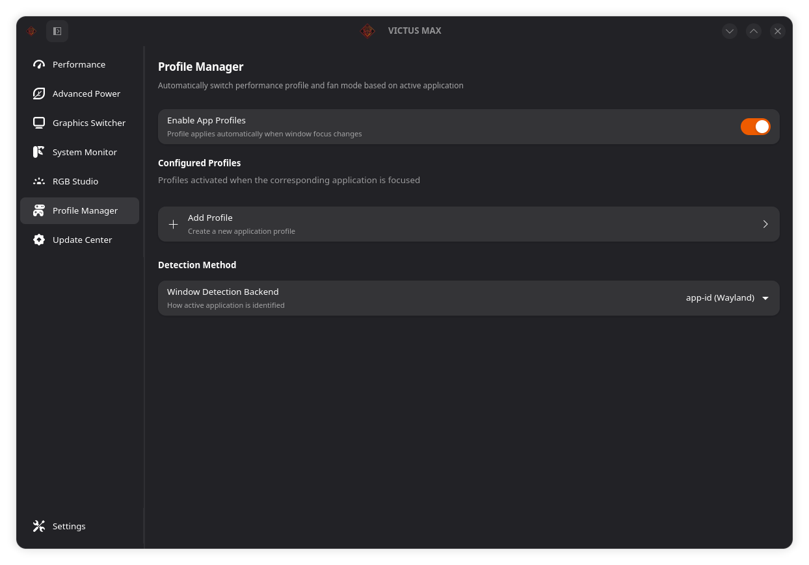
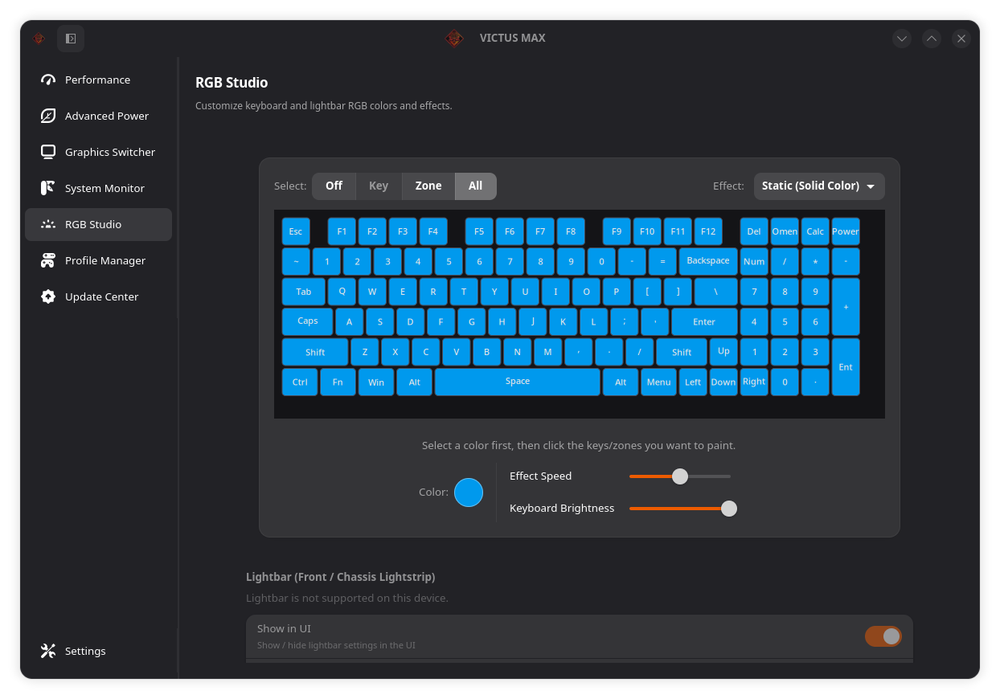
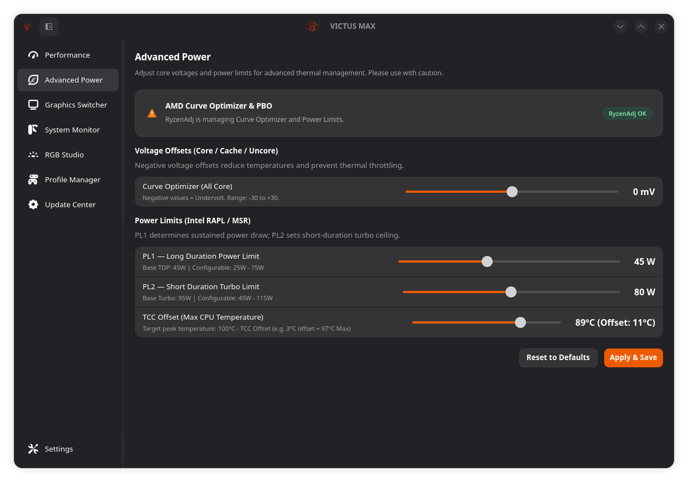
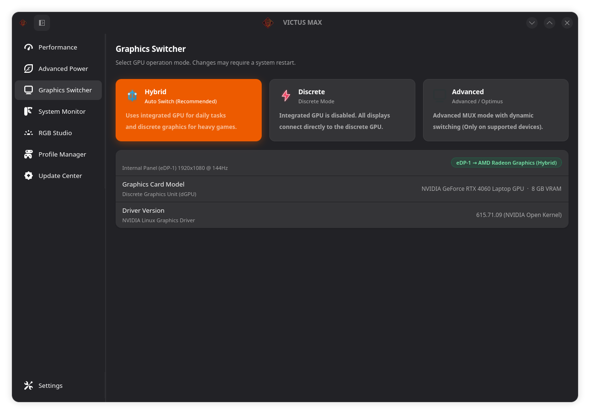
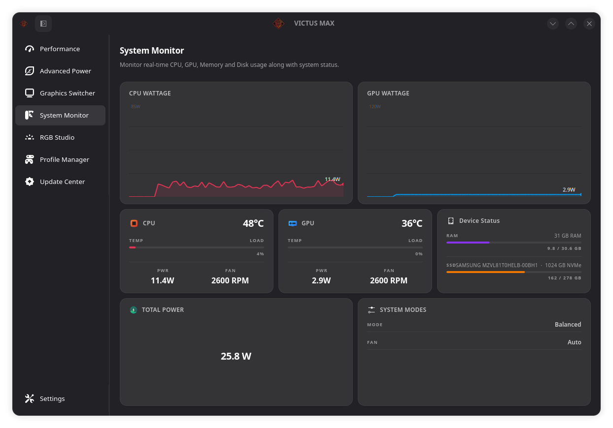
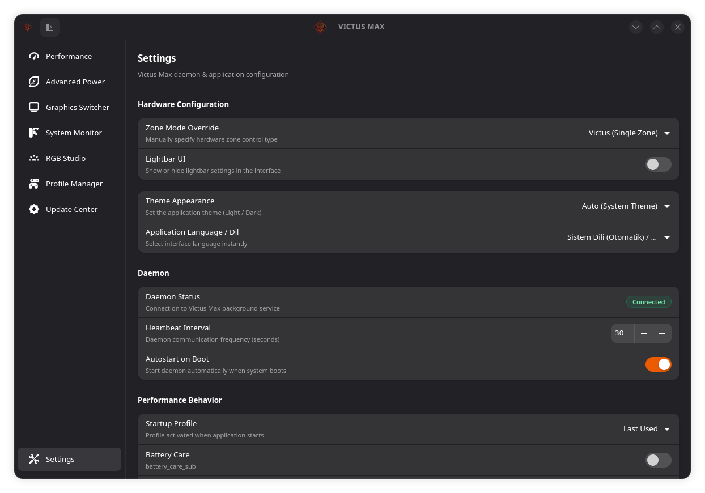
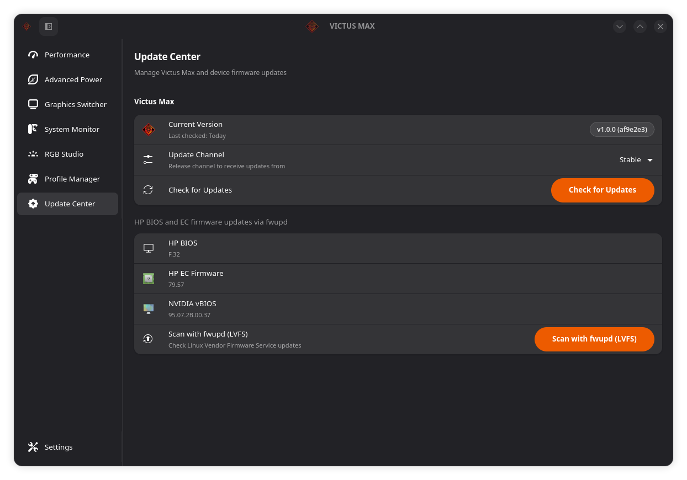
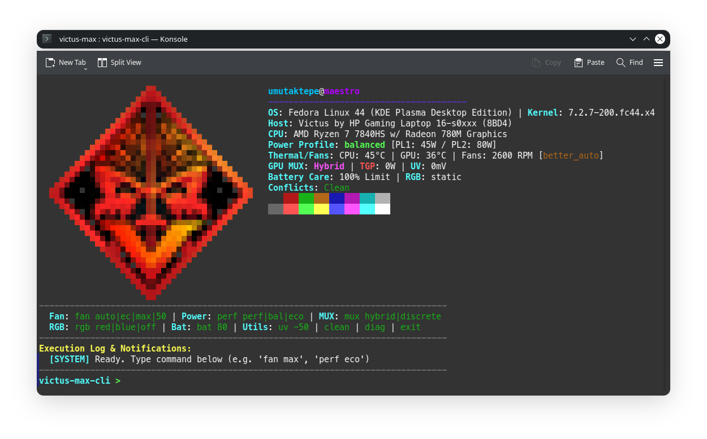

<div align="center">
  

  # Victus Max

  **The next-generation, lightweight Linux control center for HP Victus & OMEN laptops.**  
  *Powered by proactive "Better Auto" cooling and written entirely in native Rust & GTK4.*

  [](https://github.com/umutaktepe/victus-max)
  [](LICENSE)
  []()
  []()
</div>

---

## ✨ Key Features

Victus Max blends the best of `victus-control`'s proactive fan intelligence with `omen-space`'s native Rust performance and Libadwaita UI:

- 🧠 **Better Auto Proactive Cooling:**
  - Workload-aware fan control that reacts to CPU/GPU load spikes *before* temperatures rise.
  - 8-level dual-matrix calculation with upward/downward hysteresis to eliminate fan speed flutter and hunting.
  - **Balanced Mode Fan Baseline:** Configurable minimum fan RPM defaulted to **2600 RPM** (2000–3500 RPM selectable in Settings).
  - **Acoustic Ceiling:** User-adjustable maximum noise limit in Balanced mode (Levels 3–8 / ~3100–5800 RPM, default: Level 5 / ~3900 RPM).
  - **Emergency Thermal Bypass:** Automatically jumps to 100% full speed at ≥88°C for guaranteed hardware protection.
  - **Hardware EC Protection:** 10-second asynchronous stagger gap between Fan 1 and Fan 2 writes to prevent HP Embedded Controller bus collisions.
- 🎛️ **Fan & Thermal Mastery:** Custom spline curves, fan speed overrides, and dedicated **Fan Cleaning Mode**.
- 🎮 **Quick HUD Overlay (Shift+F2):** Zero-latency in-game floating GTK4 HUD for instant fan and power profile switching.
- ⚡ **Performance Profiles:** Decoupled power and fan control (`power-saver`, `balanced`, and `performance` with GPU TGP limits).
- 🚀 **Ryzen SMU & Undervolting:** Direct MSR undervolting, TCC offset control, GPU TGP limits, and AMD Ryzen SMU tuning.
- 🌈 **RGB Studio:** Hardware-accelerated 4-Zone, 1-Zone, and Per-Key keyboard lighting.
- 🖥️ **Rich CLI & D-Bus IPC:** Control everything via `victus-max-cli fan` and D-Bus interfaces.

---

## ⚡ Quick Install

The easiest way to install OMEN Space is via our 1-line web installer. It detects your distro, handles dependencies, and compiles everything automatically.

```bash
curl -sSL https://raw.githubusercontent.com/yunusemreyl/omen-space/main/install.sh | sudo bash
```

> **Pro Tip:** To install the bleeding-edge canary version directly, append `--canary`:  
> `curl -sSL https://raw.githubusercontent.com/yunusemreyl/omen-space/main/install.sh | sudo bash -s -- --canary`

<details>
<summary><b>📦 Alternative Installation Methods (Manual, AUR, NixOS)</b></summary>

**Via Git Clone (Ubuntu/Debian, Fedora, Arch, openSUSE):**
```bash
git clone https://github.com/yunusemreyl/omen-space.git
cd omen-space
sudo ./setup.sh install
```

**Arch Linux (AUR):**
```bash
git clone https://github.com/yunusemreyl/omen-space.git
cd omen-space
makepkg -si
```

**NixOS (Flakes):**
```bash
nix profile install github:yunusemreyl/omen-space
```

**Uninstall:**
If you installed via the quick install script or `setup.sh`:
```bash
cd omen-space
sudo ./setup.sh uninstall
```
*(If you deleted the folder, just run `git clone https://github.com/yunusemreyl/omen-space.git` again first).*
</details>

---

## 📸 Screenshots

<p align="center">
  
  
</p>
<p align="center">
  
  
</p>

<details>
<summary><b>🔍 View More Screenshots (MUX, Diagnostics, Settings, Updater, CLI)</b></summary>
<br>
<p align="center">
  
  
</p>
<p align="center">
  
  
</p>
<p align="center">
  
</p>
</details>

---

## 🏗️ Architecture

OMEN Space is a complete rewrite of the legacy Python *OmenCtl*, moving to **Rust** to achieve a ~3MB footprint, less than 5MB of RAM usage, and instant responsiveness.

- **`omen-space-daemon`**: The backend. Runs as a systemd service (root), managing WMI, ACPI, Sysfs, and MSR interactions over secure D-Bus.
- **`omen-gui`**: A beautifully fast GTK4 + Libadwaita frontend running in user-space.
- **`omen-tray`**: A lightweight desktop panel applet for quick profile toggling.
- **`omen-cli`**: A fast scriptable terminal interface. Now with HUD commands (`omen-cli overlay toggle`, `omen-cli overlay daemon`).
- **`hp-omen-extra`**: The underlying DKMS kernel driver extending standard kernel capabilities.

---

## 👨‍💻 Credits & License

OMEN Space is licensed under the **GPL-3.0 License** and is driven by an incredible community.

- **[yunusemreyl](https://github.com/yunusemreyl)** - Lead Developer
- **[tuxov](https://github.com/tuxov)** - Kernel Module Lead

Thanks to all our contributors: [@aloshy0](https://github.com/aloshy0), [@CodesRahul96](https://github.com/CodesRahul96), [@xcellsior](https://github.com/xcellsior), [@TitoTFP](https://github.com/TitoTFP), [@SafSaf0999](https://github.com/SafSaf0999), [@yijean34-source](https://github.com/yijean34-source), and the projects `omencore` & `omen-rgb-keyboard`.

*Disclaimer: OMEN Space is an independent project and is NOT affiliated with or endorsed by HP.*
