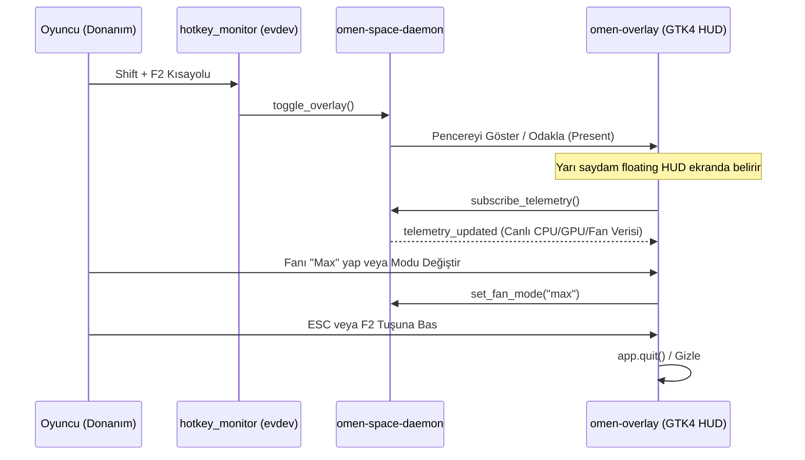

# Oyun İçi Hızlı HUD Paneli (Quick HUD Overlay)

## Genel Bakış
`omen-overlay` (`src/omen-overlay/`), tam ekran oyun oynarken oyuncunun masaüstüne dönmesine gerek kalmadan sıcaklıkları, fan hızlarını ve güç profillerini anlık izleyip değiştirmesini sağlayan hafif, yarı saydam bir GTK4 HUD bileşenidir.

Topluluk katkısıyla mimariye eklenen bu özellik (`GDK_BACKEND=wayland` öncelikli), Linux gaming deneyimini Windows OMEN Gaming Hub'ın ötesine taşımaktadır.

## Çalışma Mantığı ve Tetikleme

## Arayüz Özellikleri (`overlay_window.rs`)

1. **Canlı Telemetri Kartı:** CPU sıcaklığı, GPU sıcaklığı, toplam güç çekimi (Watt) ve anlık fan devir sayısı (RPM).
2. **Hızlı Profil Değiştirici:** Tek bir dokunuşla `Balanced`, `Performance` ve `Quiet` modları arasında geçiş.
3. **Maksimum Fan Butonu:** Zorlu çatışmalarda donanımı anında serinletmek için tek tuşla %100 fan tetiği.
4. **Hafif Tasarım (`style.css`):** Yarı saydam arka plan (backdrop-filter benzeri GTK gölgelendirmesi) ve oyun görüşünü engellemeyen minimalist yerleşim.

## İlgili Bağlantılar
- Kısayol Dinleyici: [[hotkey-monitor]]
- Telemetri Şartnamesi: [[system-telemetry-spec]]
- Ana Uygulama: [[gui-application]]
