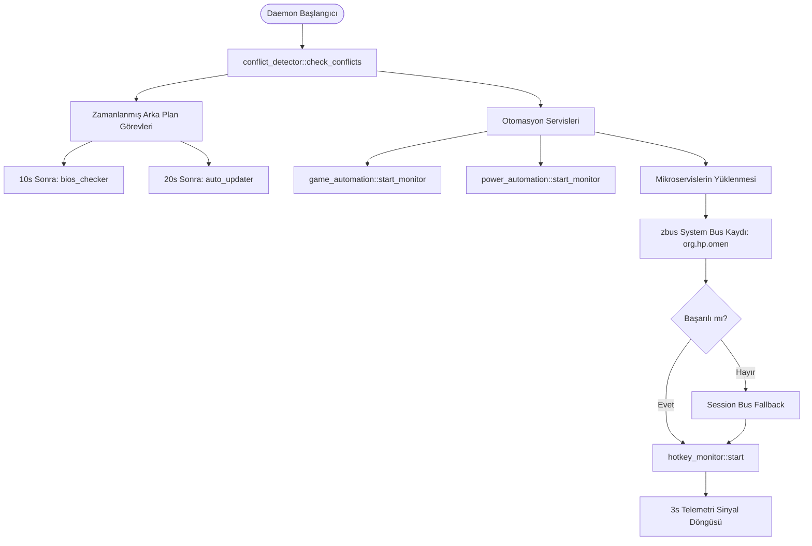

# Victus Max Daemon Mimarisi ve Yaşam Döngüsü

## Genel Bakış
`victus-max-daemon`, Victus Max ekosisteminin merkezinde yer alan, root yetkileriyle arka planda çalışan ve donanım kontrolünü soyutlayan çekirdek sistem servisidir (`src/victus-max-daemon/src/main.rs`). Geriye dönük uyumluluk için `omen-space-daemon` adı sembolik bağ olarak korunmaktadır.

Daemon; Tokio asenkron çalışma zamanı üzerinde koşan, `zbus` kütüphanesiyle Linux System Bus üzerinde `org.hp.omen` adıyla yayın yapan mikroservis tabanlı bir mimariye sahiptir.

## Başlatma Sırası (Startup Lifecycle)

Daemon başlatıldığında aşağıdaki adımları sırayla ve güvenli biçimde yürütür:

## D-Bus Üzerinde Sunulan Mikroservis Nesneleri

Daemon, sistem veri yolunda aşağıdaki nesne yollarını (object paths) ve servisleri dinler:

| D-Bus Yolu | İlgili Servis | İşlev |
| :--- | :--- | :--- |
| `/org/hp/omen/Fan` | [[fan-service]] | Fan modları, termal koruma, özel eğriler |
| `/org/hp/omen/Power` | [[power-service]] | ACPI termal profilleri, PL1/PL2 güç limitleri |
| `/org/hp/omen/Rgb` | [[rgb-service]] | Klavye ve kasa RGB LED kontrolü, efektler |
| `/org/hp/omen/Mux` | [[mux-service]] | dGPU/iGPU ekran yönlendirme anahtarı |
| `/org/hp/omen/Platform` | [[platform-service]] | Pil sağlığı koruması, fan temizleme, triage bundle |
| `/org/hp/omen/Undervolt` | [[undervolt-service]] | Intel MSR voltaj ve TCC ofsetleri |
| `/org/hp/omen/Ryzen` | [[ryzen-service]] | AMD SMU limitleri ve Curve Optimizer |
| `/org/hp/omen/SysMon` | [[sysmon-service]] | Sistem telemetrisi ve donanım raporları |
| `/org/hp/omen/AppProfiles` | [[game-automation-service]] | Süreç bazlı otomatik profil tetikleme |

## Asenkron Telemetri Döngüsü
`main.rs` içinde 3 saniyede bir tetiklenen hafif bir arka plan döngüsü, [[sysmon-service]] üzerinden donanım istatistiklerini derler ve `SysMonInterface::telemetry_updated` sinyaliyle bağlı tüm istemcilere ([[gui-application]], [[quick-hud-overlay]]) JSON olarak dağıtır.

## İlgili Bağlantılar
- Mimari Karar: [[adr-001-rust-daemon-client-split]]
- D-Bus Protokolü: [[dbus-ipc-protocol]]
- Güvenlik: [[polkit-dbus-security]]
- Sistem Servisi: [[systemd-services]]
