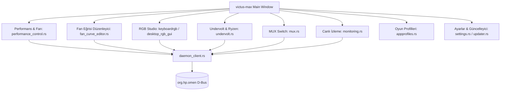

# Victus Max Grafik Kullanıcı Arayüzü (GTK4 + Libadwaita)

## Genel Bakış
`victus-max` (`src/victus-max-gui/`), modern GNOME tasarım ilkelerine uygun olarak GTK4 ve Libadwaita kütüphaneleriyle geliştirilmiş birincil masaüstü kontrol merkezidir. Geriye dönük uyumluluk için `omen-gui` sembolik bağı korunur.

[[adr-001-rust-daemon-client-split]] mimari kararı uyarınca tamamen unprivileged standart kullanıcı oturumunda çalışır ve donanımla `daemon_client.rs` üzerinden D-Bus ile haberleşir.

## Mimari Bileşenler ve Sekmeler

Arayüz modüler sekmelere ayrılmıştır:

### 1. Canlı İzleme (`monitoring.rs`)
D-Bus `telemetry_updated` sinyaline abone olarak CPU yükü, sıcaklıklar, GPU kullanımı ve fan devirlerini (RPM) gecikmesiz gösterir.

### 2. Performans ve Fan Denetimi (`performance_control.rs`)
ACPI termal profilleri (`power-saver`, `balanced`, `performance`) ve fan modları (`better_auto`, `auto`, `max`, `custom`) arasında anında tek tıkla geçiş sağlar.

### 3. Fan Eğrisi Editörü (`fan_curve_editor.rs`)
Detaylı analiz için bkz: [[fan-curve-editor-ui]].

### 4. RGB Studio (`keyboardrgb/`)
4 bölgeli klavyeler için renk tekeri, animasyon hızı ve parlaklık kontrolleri sunar; per-key modellerde tuş bazlı interaktif boyama matrisi içerir.

### 5. Undervolt ve SMU Ayarları (`undervolt.rs`)
İşlemci mimarisine (Intel vs AMD) göre dinamik olarak şekillenir; voltaj ofset kaydırıcıları ve güvenlik uyarıları içerir.

### 6. MUX Switch (`mux.rs`)
Ekran yönlendirmesini değiştirir ve yeniden başlatma onayı isteyen AdwDialog penceresini açar.

### 7. Otomatik Tray Başlatıcı (`ensure_tray_running`)
`victus-max` açıldığında arka planda `victus-max-tray` sürecinin çalışıp çalışmadığını kontrol eder (`pgrep -x victus-max-tray`), çalışmıyorsa kullanıcı için otomatik olarak başlatır.

## İlgili Bağlantılar
- Mimari Karar: [[adr-001-rust-daemon-client-split]]
- D-Bus İstemcisi: [[dbus-ipc-protocol]]
- Fan Editörü: [[fan-curve-editor-ui]]
- Sistem Tepsisi: [[system-tray]]
