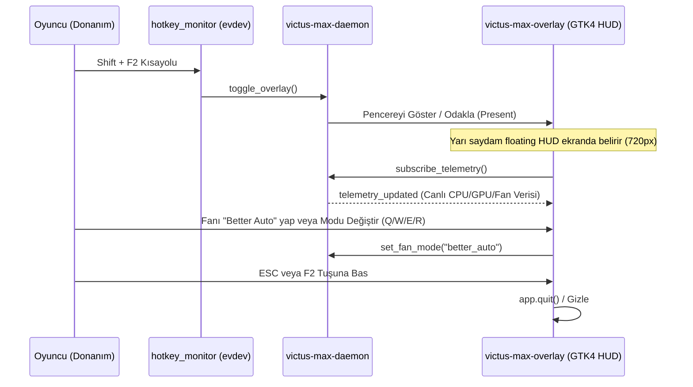

# Oyun İçi Hızlı HUD Paneli (Quick HUD Overlay)

## Genel Bakış
`victus-max-overlay` (`src/victus-max-overlay/`), tam ekran oyun oynarken oyuncunun masaüstüne dönmesine gerek kalmadan sıcaklıkları, fan hızlarını ve güç profillerini anlık izleyip değiştirmesini sağlayan hafif, yarı saydam bir GTK4 HUD bileşenidir.

Topluluk katkısıyla mimariye eklenen bu özellik (`GDK_BACKEND=wayland` öncelikli), Linux gaming deneyimini Windows OMEN Gaming Hub'ın ötesine taşımaktadır.

## Çalışma Mantığı ve Tetikleme

## Arayüz Özellikleri (`overlay_window.rs`)

1. **Victus Max Marka Başlığı:** Özel hibrit Victus/OMEN vektör logosu ve Shift+F2 kısayol rozeti.
2. **Canlı Telemetri Şeridi:** CPU sıcaklığı/gücü, GPU sıcaklığı/gücü, çift fan RPM (`fan1 / fan2 RPM`) ve RAM kullanım miktarı.
3. **Güç Profilleri (1-3):** Sistem temasından bağımsız yerel SVG ikonlarıyla donatılmış `Sessiz [1]`, `Dengeli [2]` ve `Performans [3]` modları.
4. **4'lü Fan Modu Izgarası (Q/W/E/R):**
   - **Better Auto [Q]:** Proaktif CPU yükü ve sıcaklık matrisli dinamik fan kontrolü (`active-better-auto` turuncu/kırmızı neon vurgu).
   - **Otomatik [W]:** BIOS/EC dinamik soğutma eğrisi.
   - **Maksimum [E]:** %100 turbo fan tetiği (`active-turbo`).
   - **Özel [R]:** Kullanıcı tanımlı fan eğrisi.
5. **Hafif Tasarım (`style.css`):** Yarı saydam arka plan (backdrop-filter benzeri GTK gölgelendirmesi) ve oyun görüşünü engellemeyen minimalist yerleşim.

## İlgili Bağlantılar
- Kısayol Dinleyici: [[hotkey-monitor]]
- Fan Servisi & Better Auto: [[fan-service]]
- Mimari Karar: [[adr-005-better-auto-proactive-fan-and-victus-max]]
- Telemetri Şartnamesi: [[system-telemetry-spec]]
- Ana Uygulama: [[gui-application]]
