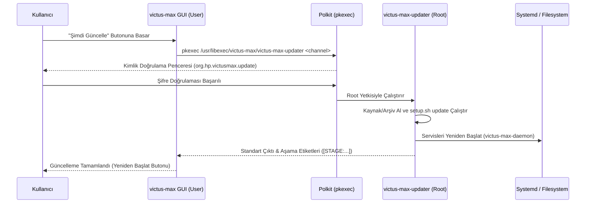

# Güncelleme Merkezi ve OTA Dağıtım Mimarisi (Updater Service)

## Genel Bakış
Victus Max Güncelleme Merkezi (`src/victus-max-gui/src/updater.rs`), GTK4 ve Libadwaita bileşenleri üzerine inşa edilmiş, hem uygulama bileşenlerini hem de sistem çekirdek modüllerini güvenli bir şekilde güncelleyen yerel bir Over-The-Air (OTA) güncelleme motorudur.

[[adr-001-rust-daemon-client-split]] uyarınca unprivileged (ayrıcalıksız) kullanıcı alanında çalışan grafik arayüz, güncelleme durumunu GitHub REST API üzerinden sorgular ve yetki gerektiren sistem güncelleme işlemlerini PolicyKit ([[polkit-dbus-security]]) aracılığıyla izole bir root yardımcı servise devreder.

## Kanal Mimarisi (Canary vs Stable)
Kullanıcı deneyimini ve sistem kararlılığını optimize etmek amacıyla iki farklı dağıtım kanalı sunulur:

1. **Canary Kanalı (Geliştirme / En Güncel):**
   - GitHub deposunun `main` dalındaki en son commit'leri doğrudan takip eder.
   - En yeni donanım yamaları, fan eğrisi optimizasyonları ve arayüz geliştirmelerini anında kullanmak isteyen ileri düzey kullanıcılar içindir.
   - Derleme anında ikili dosyaya gömülen `VICTUS_MAX_GIT_HASH` ortam değişkeni ile GitHub'daki en güncel commit SHA özetini karşılaştırır.
2. **Stable Kanalı (Kararlı / Resmi Sürümler):**
   - GitHub Releases üzerinde yayınlanmış resmi sürüm etiketlerini (`v*.*.*`) takip eder.
   - SemVer karşılaştırması (`is_newer_semver`) ile mevcut sürüm ile hedef sürüm arasındaki farkı denetler.
   - Maksimum sistem kararlılığı ve doğrulanmış sürüm paketleri tercih eden kullanıcılar içindir.

## Kalıcı Konfigürasyon
Kullanıcının seçtiği güncelleme kanalı, uygulama kapatıldığında kaybolmaması için yerel kullanıcı dizininde JSON formatında kalıcı olarak saklanır:

- **Dosya Konumu:** `~/.config/victus-max/settings.json` (geriye dönük uyumluluk için `~/.config/omenspace/settings.json` fallback desteği bulunur).
- **Ayar Şeması:**
```json
{
  "theme": "dark",
  "start_minimized": true,
  "update_channel": "canary"
}
```
Arayüzdeki kanal açılır menüsü (`AdwComboRow`) değiştirildiği anda `update_checker::save_update_channel` fonksiyonu tetiklenir; mevcut diğer ayar alanları korunarak dosya atomik olarak güncellenir.

## GitHub REST API Entegrasyonu & Sıfır-404 Fallback
Güncelleme denetimi, Tokio asenkron çalışma zamanı üzerinde `curl` aracılığıyla GitHub REST API'sine sorgu atar (`src/victus-max-gui/src/update_checker.rs`):

- **Stable Uç Noktası:** `https://api.github.com/repos/umutaktepe/victus-max/releases/latest`
- **Canary Uç Noktası:** `https://api.github.com/repos/umutaktepe/victus-max/commits/main`

### Sıfır-404 Fallback Mekanizması
Yeni açılmış veya henüz resmi bir Release etiketlenmemiş GitHub depolarında `/releases/latest` çağrısı HTTP 404 (Not Found) durum kodu döner. Eski mimaride bu durum sistemin çökmesine veya hata vermesine neden olurken, Victus Max şu adımları izler:
1. `UpdateCheckError::NoReleaseFound` yakalanır.
2. Güncelleyici otomatik olarak `UpdateChannel::Canary` kanalını arka planda sorgular.
3. Sonuç nesnesine `fallback_to_canary: true` bayrağı atanır.
4. GUI üzerinde turuncu renkte bir `AdwBanner` açılarak:
   > *"Resmi sürüm bulunamadı, en güncel geliştirme sürümü (Canary) gösteriliyor."*
   bilgisi kullanıcıya sunulur. Böylece güncelleme süreci asla kesintiye uğramaz.

## Sistem Güncelleyici ve Polkit Yetkilendirmesi
Victus Max GUI ayrıcalıksız bir kullanıcı oturumunda çalıştığından, sistem dosyalarını (`/usr/bin/`, `/usr/libexec/`, `/usr/share/`) doğrudan değiştiremez.

Güvenli güncelleme akışı şu şekilde işler:


- **Yardımcı Betik:** `/usr/libexec/victus-max/victus-max-updater`
- **PolicyKit Eylem Tanımı:** `/usr/share/polkit-1/actions/org.hp.victusmax.update.policy`
- **Eylem Kimliği:** `org.hp.victusmax.update`
- **İzin Politikası:** `auth_admin_keep` ile yönetici şifresi doğrulandıktan sonra oturum boyunca root erişimi sağlanır.

## Aşamalı İlerleme Takibi (Stage Tags)
Güncelleme işlemi sırasında terminal çıktısı arka planda okunur ve önceden tanımlanmış aşama etiketlerine göre GUI durum çubuğu (`ProgressBar`) anlık olarak güncellenir:

| Aşama Etiketi | İlerleme | Açıklama |
| :--- | :--- | :--- |
| `[STAGE:PREPARE]` | %15 | Sistem bağımlılıkları ve çalışma ortamı hazırlanıyor |
| `[STAGE:DOWNLOAD]` | %35 | GitHub üzerinden kaynak kodlar veya ikili paket alınıyor |
| `[STAGE:BUILD]` | %70 | Bileşenler derleniyor veya prebuilt paket doğrulanıyor |
| `[STAGE:INSTALL]` | %85 | Sistem dosyaları, udev kuralları ve D-Bus politikaları kuruluyor |
| `[STAGE:RESTART]` | %95 | `victus-max-daemon` ve systemd servisleri yeniden başlatılıyor |
| `[STAGE:COMPLETE]` | %100 | Güncelleme başarıyla tamamlandı |

GUI, kullanıcıya isteğe bağlı olarak açıp kapatabileceği bir terminal akış kutusu (Expander / ScrolledWindow) sunarak çıktıları satır satır görme imkanı tanır. İşlem bittiğinde arayüzde doğrudan *"Uygulamayı Yeniden Başlat"* butonu belirir.

## Sürüm Otomasyonu
Victus Max ekosistemi, güncellemelerin hızlı ve hatasız dağıtılması için tam otomasyona sahiptir:

1. **Yerel Sürüm Yükseltme (`scripts/release.sh`):**
   - Yeni sürüm numarasını parametre olarak alır (örn: `2.1.4`).
   - Workspace içerisindeki tüm `Cargo.toml` dosyalarında sürüm alanını ve `omen-types` bağımlılıklarını günceller.
   - `cargo check --workspace` ile doğrular, git commit'i oluşturur ve `v2.1.4` etiketini atar.
2. **GitHub Actions CI/CD (`.github/workflows/release.yml`):**
   - `v*.*.*` etiketleri depoya gönderildiğinde otomatik olarak tetiklenir.
   - Ubuntu üzerinde tüm bileşenleri derler, test paketini çalıştırır ve `dist/` arşivini (`victus-max-v2.1.4-x86_64.tar.gz`) oluşturup GitHub Release sayfasına ekler.
3. **Hızlı Kurulum Desteği (`setup.sh`):**
   - `setup.sh` betiği, arşiv içerisinde `dist/bin/` dizini tespit ettiğinde derleme adımını atlayarak önceden derlenmiş ikili dosyaları saniyeler içinde `/usr/bin/` ve `/usr/libexec/` altına yerleştirir.

## İlgili Bağlantılar
- Mimari Karar: [[adr-006-github-update-and-release-architecture]]
- Grafik Kullanıcı Arayüzü: [[gui-application]]
- Polkit Güvenlik Politikası: [[polkit-dbus-security]]
- Sistem Servisleri: [[systemd-services]]
